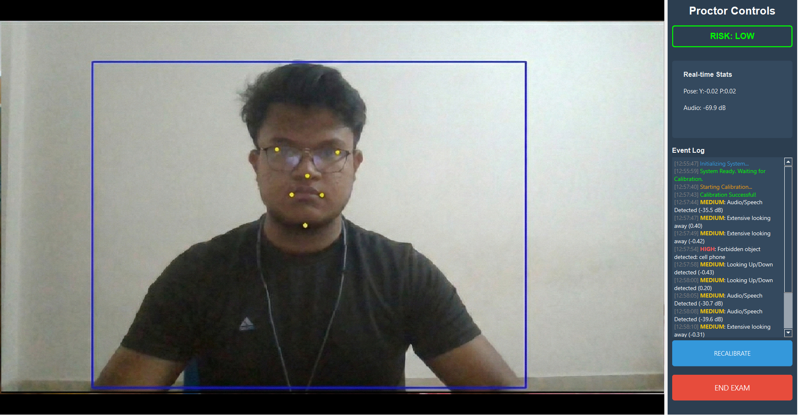

<div align="center">

# 🧠 Intelligent Exam Proctoring System

### AI-Powered Real-Time Behavioral Analysis for Exam Security


<br>



<br>

**A decentralized, privacy-first computer vision assistant that helps proctors identify high-risk behaviors in real-time.**
<br>
_Detects Phones, Multiple People, Audio Violations, and Gaze Aversion without recording video._

</div>

---

## 🚀 Features

| Feature                          | Description                                                                                               |
| :------------------------------- | :-------------------------------------------------------------------------------------------------------- |
| **👀 Head Pose & Gaze Tracking** | Uses 3D face landmarks to detect looking away (Yaw/Pitch) with auto-calibration logic.                    |
| **📱 Object Detection**          | Identifies **Mobile Phones**, **Multiple People**, and **Headphones** using high-speed YOLOv8.            |
| **🎙️ Audio Analysis**            | Monitors microphone for speech patterns and high-decibel anomalies.                                       |
| **🧠 Behavior Risk Engine**      | Aggregates temporal data to flag **Gaze**, **Pitch**, and **Voice** violations with a rolling risk score. |
| **📊 Proctor Dashboard**         | **Real-Time Sidebar** with an Event Log, Calibration Progress Bar, and Live Telemetry (0.1s latency).     |
| **🔒 Privacy First**             | **No Video Storage.** All analysis happens locally in memory. Only metadata (logs) is retained.           |

## 🛠️ Tech Stack

- **Core**: Python 3.10+
- **GUI Engine**: **PyQt6** (Threaded Worker Pattern)
- **Vision Models**:
  - **MediaPipe Tasks** (Face Mesh)
  - **YOLOv8 Nano** (Object Detection)
  - **OpenCV** (Image Processing)
- **Logic**: Custom "Pipe & Filter" Architecture with Pydantic Schemas.

## 📦 Installation

```bash
# 1. Clone the repository
git clone <repository-url>
cd cheat-detection

# 2. Install Dependencies
pip install -r requirements.txt
```

## ▶️ Usage

1.  **Run the App**:

    ```bash
    python run.py
    ```

    _(First run will download AI models automatically)_

2.  **Calibrate**:
    - Click **"CALIBRATE"** in the sidebar.
    - Look straight at the camera for 2 seconds.
    - Wait for the blue progress bar to fill.

3.  **Monitor**:
    - Watch the **Event Log** for "High Risk" alerts.
    - The video feed will highlight detected objects in Red/Green.

## ⚙️ Configuration

Tune the system in `app/config.py`:

| Parameter                 | Default                       | Description                             |
| :------------------------ | :---------------------------- | :-------------------------------------- |
| `active_modules`          | `['face', 'object', 'audio']` | Toggle specific detectors on/off        |
| `weight_gaze`             | `0.5`                         | Sensitivity to looking away (0.0 - 1.0) |
| `weight_phone`            | `1.5`                         | Risk score penalty for phone detection  |
| `max_frames_looking_away` | `3`                           | Frames before triggering "Looking Away" |

---

<div align="center">

**[Contributing](CONTRIBUTING.md) • [License](LICENSE) • [Devlog](DEVLOG.md)**

_Disclaimer: This tool provides decision support and does not replace human judgment._

</div>
